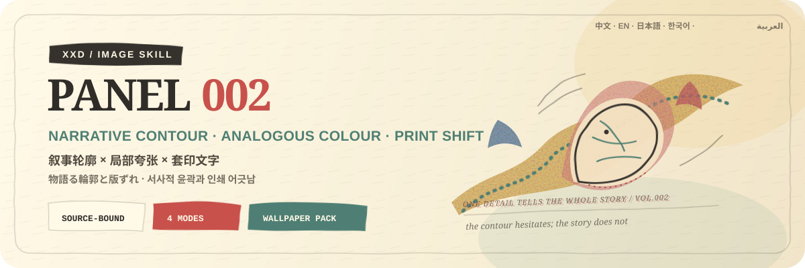
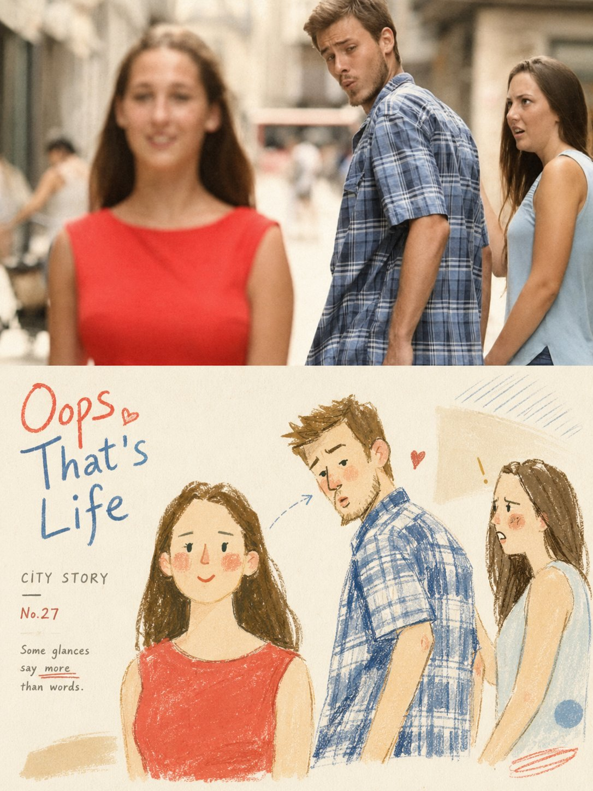
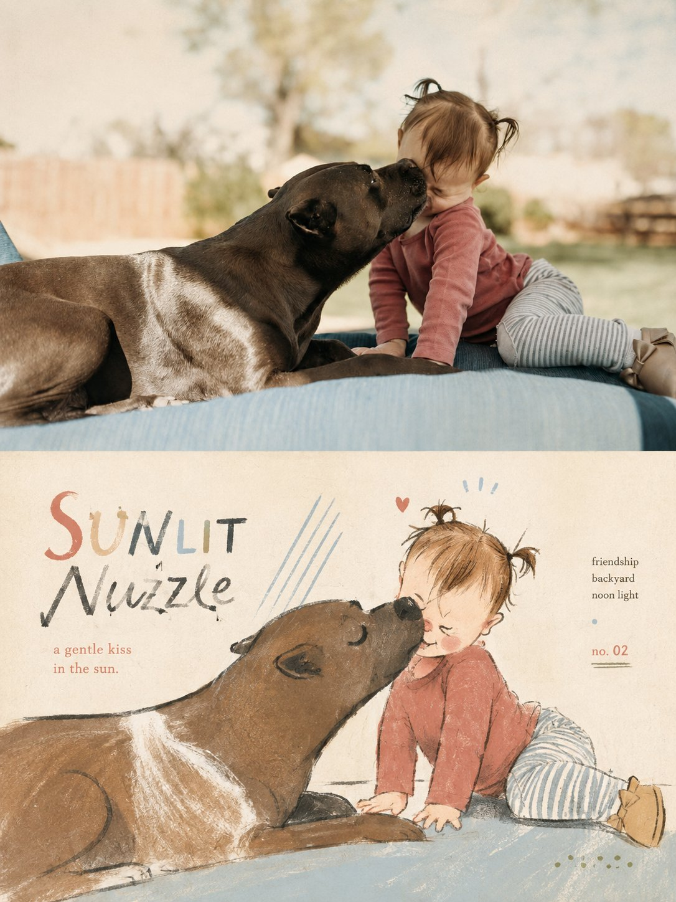
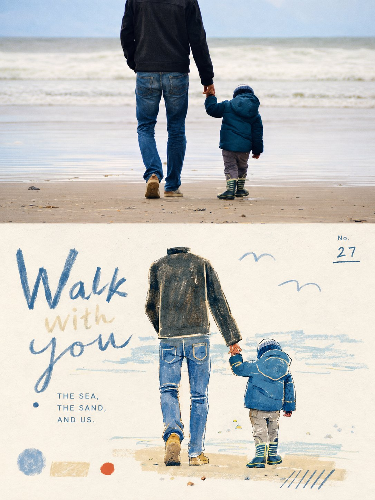

<p align="center">
  
</p>

<div align="center" dir="rtl">

# 🦁 XXD Panel 002

### يحوّل الصورة إلى رسم تحريري قديم ذي محيط سردي وخط متردد وحروف مزاحة الطباعة

[](./SKILL.md)
[](#أربعة-مخرجات-ومنطق-يدوي-واحد)
[](#الحدود-والثقة)

<a href="README.md">简体中文</a> · <a href="README.en.md">English</a> · <a href="README.ja.md">日本語</a> · <a href="README.ko.md">한국어</a> · <strong>العربية</strong>

</div>

<div dir="rtl">

> محيط سردي · خط متردد · ألوان متجاورة · تكبير انتقائي · حروف مزاحة

XXD Panel 002 مهارة لتوليد الصور مخصّصة لـ Codex والوكلاء المتوافقين. تحافظ بدقة على هوية الموضوع والعاطفة الظاهرة والوضعية والعلاقة المكانية، ثم تترجمها بمحيط متردد وتكبير انتقائي لتفصيل سردي واحد وغسلات رخوة وانزياح طباعة قديم إلى صفحة بين كتاب أزياء مصوّر محفوظ ومجلة فن معاصرة.

لا تنسخ النتيجة سطح الصورة، بل تجد تحويلاً بصرياً واحداً ذكياً وخفيفاً مرتبطاً بها. تجمع بين الرسم التحريري الحداثي، ونظام الباوهاوس، ودفء كتب الأطفال، وعفوية رسم الأزياء. تبدو الكتابة كملاحظة مقتصدة تركها الرسام، لا كعنوان إعلاني أضيف لاحقاً.

## لماذا توجد 002؟

يتحوّل «الأسلوب المرسوم باليد» بسهولة إلى كرتون لطيف عام: حدود شديدة النعومة، ولوحة ألوان قابلة للتبديل بين أي صورتين، أو ضجيج رقمي يتظاهر بأنه ورق وصباغ.

تعكس 002 هذا الترتيب:

```text
تثبيت حقائق المصدر ← إيجاد استعارة بصرية خاصة بالصورة ← التبسيط بخط رخو غير مثالي ← مزج الألوان المائية والغواش والقلم والباستيل ← إبقاء الورق الدافئ يتنفس ← إضافة حروف يدوية قديمة ومقتصدة
```

إذا أمكن استبدال المصدر بصورة لا صلة لها من دون تغيير جوهري في الموضوع أو الاستعارة أو الإيماءة أو الألوان أو النص، فالنتيجة ليست 002.

## العقد البصري لـ 002

- **محيط سردي قابل للتعرّف:** يحتفظ بعلامات المصدر والوضعية والعلاقة المكانية؛ يمكن أن يتردد الخط لكن لا تضيع الهوية.
- **تحويل خاص بالصورة:** تُشتق استعارة بصرية واحدة ذكية وطبيعية من الحركة أو البنية أو البيئة أو المزاج، من دون حيلة ثابتة جاهزة.
- **تكبير انتقائي:** يكبَّر تفصيل واحد فقط يحمل الهوية أو العاطفة الظاهرة أو القصة، من دون تشويه اعتباطي.
- **محيط يدوي متردد:** يبقى رفيعاً مع تغير الضغط والانقطاع والوصلات المفتوحة؛ لا حدود متجهية ملساء.
- **طبقات خفيفة من وسائط مختلطة:** تتجاور شفافية الألوان المائية، وعتامة الغواش، وتهشير القلم الملوّن، وحبيبات الباستيل أو الشمع، والفرشاة الجافة من دون ثقل.
- **وحدة ألوان متجاورة:** تُنظم ألوان متقاربة عالية الإضاءة ومنخفضة إلى متوسطة التشبع من المصدر، مع قفزة صغيرة واحدة بلون مكمّل.
- **ورق دافئ وعدم كمال الطباعة:** ألياف وحواف خشنة ونفاذ خفيف وانزياح تسجيل طفيف كدلائل مادية، لا كضجيج رقمي متجانس.
- **حروف تنمو من الصورة:** عنوان يدوي قديم مع دعم رقيق ومحكوم، يندمج بإزاحة أو ميل أو تمدد أو تراكب لون أو انزياح طباعة محدود.

## النماذج · من X

> [Xiaoxiaodong (@xiaoxiaodong01)](https://x.com/xiaoxiaodong01/status/2089893684527730867) · 2026-08-19<br>
> GPT2 x 转绘 x 上下 x 水彩 x 美学提示词 x VOL.002

<table>
  <tr>
    <td width="50%"><a href="https://x.com/xiaoxiaodong01/status/2089893684527730867"></a></td>
    <td width="50%"><a href="https://x.com/xiaoxiaodong01/status/2089893684527730867"></a></td>
  </tr>
  <tr>
    <td width="50%"><a href="https://x.com/xiaoxiaodong01/status/2089893684527730867"></a></td>
  </tr>
</table>

<p align="center"><a href="https://x.com/xiaoxiaodong01/status/2089893684527730867">عرض المنشور الأصلي والتوجيه كاملاً ←</a></p>

تعرض هذه النماذج الدافع الجمالي للإصدار 002 فقط؛ ولا تصبح موضوعاتها أو تكوينها أو ألوانها أو نصوصها أو نسبة اللوحة السابقة مراجع للتوليد أو إعدادات افتراضية حالية.

## أربعة مخرجات قابلة للجمع

يمكن اختيار نمط واحد أو عدة أنماط بـ `1` أو `1+3` أو `1,2,4` أو `الكل`؛ وينتج «الكل» سبعة ملفات PNG مستقلة لكل مصدر. بعد اختيار النمط وقبل التوليد، تُحسم نسبة لوحة الناتج كاملة: `3:4` الخاصة بالتوجيه الأصلي، أو نسبة المصدر باختيار صريح، أو نسبة شائعة، أو نسبة／بكسلات مخصصة. لا تُطبّق أبعاد المصدر ضمنياً.

| النمط | قاعدة اللوحة | الناتج |
| --- | --- | --- |
| `top-bottom` | لوحة نهائية أكدها المستخدم | توليد كامل واحد: المصدر عالي الوفاء في الأعلى وتصميم 002 في الأسفل، نحو 50/50 |
| `left-right` | لوحة نهائية أكدها المستخدم | توليد كامل واحد: المصدر عالي الوفاء يساراً وتصميم 002 يميناً، نحو 50/50 |
| `design-only` | لوحة نهائية أكدها المستخدم | يملأ تصميم 002 اللوحة ولا تظهر صورة المصدر |
| `wallpaper-pack` | تأكيد مستقل لكل جهاز | ملفات PNG منفصلة للهاتف وiPad والحاسوب وساعة الأطفال |

تستخدم الأنماط الثنائية المصدر كمدخل تحرير／مرجع عالي الوفاء، وتولّد التكوين النهائي مباشرة بتوجيه الأسلوب الكامل كي تتماسك الصورة والتصميم واللون والضوء والكتابة والمعنى. ولا يُستخدم التركيب الحتمي إلا بعد فشل إعادة محاولة محددة للوحة الكاملة، أو عند طلب حفظ المصدر بكسلاً ببكسل، أو عجز مسار التوليد عن تحقيق اللوحة، أو للحاجة إلى معايرة نهائية بلا فقد.

يمكن أن تكون الخلفيات مترابطة أو مستقلة. تعتمد المترابطة عملاً مرجعياً واحداً لـ iPad ثم تعيد تكوين كل جهاز من الأصل والمرجع نفسه. أما المستقلة فيرجع كل جهاز فيها إلى الأصل وحده. ولا يقص أي منهما ناتج جهاز آخر ولا يسلسل المشتقات.

## يجب أن ينمو النص من داخل الرسم

قبل التوليد، اختر نصاً تلقائياً أو نصاً مخصصاً أو نتيجة بلا نص. عند وجود نص، حدّد اللغة أو المنطقة المستهدفة.

يستخلص النص التلقائي عنواناً قصيراً واحداً من هوية الموضوع أو المكان المعروف أو الجو المرئي أو معنى رمزي تؤيده الصورة. يمكن أن يكون دافئاً وشاعرياً، لكنه لا يفرض تلاعباً لفظياً أو انقلاباً أو «لحظة فهم» موحّدة.

العنوان الواحد هو الإعداد الافتراضي. لا تُضاف من صفر إلى ملاحظتين قصيرتين إلا حين تحملان معلومة حقيقية، ولا تُختلق أرقام أو سنوات أو إحداثيات أو ملصقات أرشيفية لمجرد إظهار الرقي.

يحافظ على النص النهائي الذي يقدمه المستخدم حرفياً. أما الاتجاه الإبداعي أو المسودة القابلة للتحرير فلا تُصقل إلا مع الحفاظ على الجمهور والهدف والكلمات الإلزامية والنبرة والدلالة.

تتبع اللغة الجمهور المقصود لا لغة الأمر:

```text
السوق أو الجمهور المستهدف > لغة الناتج المحددة > لغة التوجيه؛ وإذا غابت كلها يُسأل المستخدم قبل التوليد
```

تستخدم النسخة اليابانية يابانية طبيعية، والنسخة الكورية كورية طبيعية بمسافات صحيحة، والنسخة البريطانية إنجليزية بريطانية، وتستخدم العربية افتراضياً العربية الفصحى المعاصرة مع تركيب حقيقي من اليمين إلى اليسار. لا تستنتج المهارة الجنسية من الوجه أو الملابس أو المشهد أو اللافتات، ولا تستخدم نصاً أجنبياً زائفاً للزينة.

## أولوية اللوحة الكاملة وحدود الصورة النقطية

يتولى نموذج الصور إعادة البناء الجمالي للعمل النهائي كله، وتستخدم التركيبات الثنائية أيضاً توليد لوحة كاملة واحدة افتراضياً. ولا يبقى `scripts/compose_panel.py` إلا للاسترداد المشروط ومعايرة البكسلات بلا فقد والتدقيق للقراءة فقط؛ فلا يعمل مسبقاً ولا يحكم على النجاح الجمالي.

كل التسليمات ملفات PNG نقطية، وينشئ كل استدعاء مهمة جديدة تحت `~/Desktop/xxd/`. ولا يكشف مسار الصور المضبوط سوى حالة منزوعة التفاصيل، من دون المزوّد أو نقطة الاتصال أو بيانات الاعتماد أو الرؤوس أو التوجيهات أو الاستجابات أو معلومات الحساب. ولا تصلح SVG أو HTML أو Canvas أو الرسوم البرمجية بديلاً للعمل النهائي.

## البدء

```bash
git clone https://github.com/nevertoday/xxd-panel-002.git
mkdir -p ~/.codex/skills
ln -s "$(pwd)/xxd-panel-002" ~/.codex/skills/xxd-panel-002
```

يمكن لمستخدمي Claude Code ربط المجلد نفسه بـ `~/.claude/skills/xxd-panel-002`. أعد تشغيل جلسة الوكيل بعد التثبيت.

```text
$xxd-panel-002
حوّل هذه الصورة إلى تكوين يسار/يمين، واستخرج العبارة من معناها، واكتبها بالعربية الفصحى المعاصرة.
```

يمكن أيضاً استدعاء المهارة بصورة وحدها. ستسأل أولاً عن نمط واحد أو عدة أنماط وعن إعداد النص في قائمة مرقمة متعددة الأسطر؛ ويسأل نمط الخلفيات أيضاً عن الترابط والمقاسات.

المواصفات الكاملة:

- [مسار عمل المهارة](SKILL.md)
- [التوجيه الصيني الكامل](references/xxd-panel-002-prompt.zh-CN.md)
- [التوجيه الإنجليزي الكامل](references/xxd-panel-002-prompt.en.md)
- [موجز الأسلوب الأصلي](references/002-source.md)

## الحدود والثقة

- تبقى كل صورة داخل مهمتها ولا تستعير موضوعاً أو لوناً أو نصاً أو تكويناً من مدخل آخر أو نتيجة قديمة أو نموذج.
- ينشئ كل استدعاء مجلد مهمة جديداً، حتى عند تكرار المصدر والمعلمات.
- النتائج ملفات PNG نقطية، وليست SVG أو HTML أو Canvas أو بديلاً مرسوماً برمجياً.
- لا يعرض جسر الصور المضبوط سوى حالة منزوعة التفاصيل، ولا يكشف المزوّد أو نقطة الاتصال أو الرؤوس أو بيانات الاعتماد أو التوجيه أو نص الاستجابة.
- يعيد كل نمط عادي مختار ملفاً واحداً، ويضيف اختيار `wallpaper-pack` أربع خلفيات مستقلة. يعيد خيار «الكل» سبعة ملفات PNG لكل مصدر داخل أربعة مجلدات أنماط متجاورة، ولا ينشئ لوحة تجميع أو عرضاً عاماً.

يحتاج التركيب المحلي إلى Python 3 وPillow. يستخدم الجسر الآمن `tomllib` في Python 3.11 أو أحدث. ويحتاج توليد الصور إلى قدرة نقطية مدمجة في الوكيل المضيف أو مسار نقطي متوافق ومضبوط مسبقاً.

## المستودع

```text
xxd-panel-002/
├── SKILL.md
├── README.md / README.en.md / README.ja.md / README.ko.md / README.ar.md
├── agents/openai.yaml
├── assets/banner.svg + examples/ (محجوز لنماذج محلية مستقبلية)
├── scripts/compose_panel.py + configured_imagegen.py
└── references/xxd-panel-002-prompt.zh-CN.md + xxd-panel-002-prompt.en.md + 002-source.md
```

## عن XXD

XXD هو الاختصار التجاري لاسم Xiaoxiaodong. أنشأ المشروع ويديره [@xiaoxiaodong01](https://x.com/xiaoxiaodong01).

## الدعم والعضوية

### استشارة متعمقة · 299 يواناً صينياً/ساعة

تبلغ تكلفة الاستشارة الفردية المتعمقة في استخدام Skills مقدار 299 يواناً صينياً في الساعة. للحجز، تواصل عبر رمز WeChat أدناه.

### مجموعة مستخدمي Xiaoxiaodong Skills · 99 يواناً صينياً

تتيح دفعة واحدة قدرها 99 يواناً الانضمام إلى مجموعة تبادل سير العمل ومناقشة الأعمال والدعم بين المستخدمين. ولا تشمل الاستشارة الفردية المحسوبة بالساعة.

### Knowledge Planet＋مكتبة توجيهات الأعضاء · 699 يواناً صينياً/سنة

[Knowledge Planet](https://wx.zsxq.com/group/15554814142882) و[مكتبة توجيهات XXD](https://vip.xiaoxiaodong.ai/) عضوية واحدة: **دفعة سنوية واحدة تفتح الخدمتين من دون شراء ثانٍ.**

1. اشترك عبر Knowledge Planet ثم تواصل عبر WeChat للحصول على رمز استبدال المكتبة.
2. اشترك عبر مكتبة التوجيهات ثم تواصل عبر WeChat للحصول على دعوة إلى Knowledge Planet.

<p align="center">
  <a href="https://xiaoxiaodong.pages.dev/assets/wechat-qr.png"></a>
</p>

<div align="center" dir="rtl">

**دع المحيط يتعرّف إلى الشخص، ودع تفصيلاً واحداً مكبّراً يروي القصة.**

</div>

</div>

---

<div align="center" dir="rtl">
  <h2>☕ ادعم هذا المشروع مفتوح المصدر</h2>
  <p>إذا وفّر عليك المشروع وقتاً، فإن نجمة أو مشاركة أو فنجان قهوة يساعد في استمراره.</p>
  <table><tr><td align="center" width="240">
    <a href="https://github.com/nevertoday/zhongguo-traditional-colors/blob/main/docs/images/buy-me-a-coffee-qr.png?raw=true"></a><br>
    <strong>Buy me a coffee</strong><br><sub>امسح رمز QR أو افتحه لدعم Xiaoxiaodong</sub>
  </td></tr></table>
  <p><sub>الدعم اختياري تماماً ولا يغيّر حق الوصول إلى هذا المشروع مفتوح المصدر.</sub></p>
</div>
